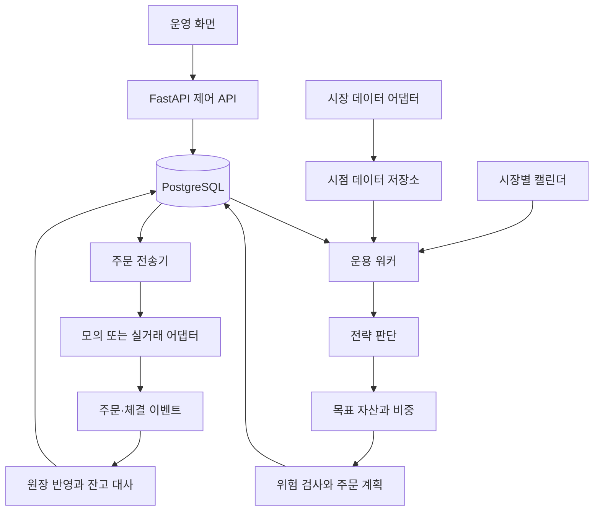

# Modelin 자동 운용 상세 설계 v1

작성: 2026-09-12 · 상태: 구현 기준안 · 실거래 연결 업체: 미정

관련 문서: [코드 진단](autonomous-trading-review.md), [데이터·API 계약](trading-contracts.md), [구현 작업과 검증 기준](trading-implementation-plan.md), [모의 운용 설정 예시](examples/paper-deployment.json)

## 1. 목표와 설계 결정

국내 주식, 미국 주식, 코인에서 데이터를 수집하고 전략을 판단하여 매수·매도하고, 주문과 잔고를 지속적으로 추적한다. 사용자는 운용 자금·전략·한도를 설정하고 운영 화면에서 현재 상태와 판단 근거를 확인한다.

이번 산출물은 상세 설계다. 여기서 명시한 인터페이스, API, 테이블과 설정 파일은 앞으로 구현할 계약이며 현재 동작하는 기능으로 표시하지 않는다.

| 결정 | 구현 기준 |
| --- | --- |
| 제품 범위 | 개인 계좌 중심, 1차는 현물 롱·현금, 일봉. 시간봉은 데이터 지원 확인 후 확장 |
| 시장 범위 | 국장·미장·코인을 모두 수용. 동일 시각에 세 시장이 열려 있다고 가정하지 않음 |
| 모드 | backtest, paper, live. 계좌·원장·주문·키를 모드별로 분리 |
| 배포 구조 | React + FastAPI 제어 API + 독립 Python 워커 + PostgreSQL |
| 전략 구조 | 전략은 목표와 이유만 반환. 증권사·DB 호출 없음 |
| 브로커 선택 | 공통 인터페이스를 먼저 구현. 업체별 어댑터는 선택 이후 추가 |
| 자동화 | 브라우저와 독립 실행. 재기동 시 잔고 대사 후 재개 |
| 계좌 충돌 | v1은 계좌 하나에 활성 deployment 하나. 한 deployment가 여러 자산을 보유할 수 있음 |
| 자금 이동 | 계좌 사이 자동 송금·자동 환전 제외. 계좌별 통화 잔고와 배정액을 관리 |
| 전략 선택 | 사용자가 검증 후 활성화. 최근 수익률만 보고 전략 자동 교체하지 않음 |

같은 전략 버전을 여러 계좌에 배포할 수 있다. 하나의 화면에서 세 시장을 묶어 보여주되 세 계좌가 현금을 공유하지 않는다. 여러 전략의 계좌 공동 운용은 추후 가상 하위 원장과 주문 상계·배분 규칙을 추가한 뒤 허용한다.

공매도·파생·레버리지·초단타는 이번 구현 범위에 넣지 않는다. 향후 별도 상품 능력(capabilities)과 증거금 모델을 추가할 수 있도록 Instrument와 Broker 계약에서 상품 종류를 구분한다.

## 2. 사용자의 정상 이용 흐름

1. 모의 계좌를 만들고 시장·거래 통화·초기자금을 지정한다.
2. 전략 유형, 대상 종목/유니버스, 판단 주기, 리밸런싱 규칙을 저장한다.
3. 백테스트 결과에서 비용, 최대 낙폭, 주문 내역, 데이터 누락을 확인한다.
4. 해당 불변 전략 버전으로 모의 운용 deployment를 만든다.
5. 워커는 데이터 준비와 계좌 상태를 확인한 후 지정 주기에 판단·주문한다.
6. 운영 화면에서 운용 중/대기/중지, 다음 판단 시각, 보유, 미체결, 마지막 잔고 대사를 확인한다.
7. 실거래는 별도 live deployment로 생성한다. 모의 계좌의 mode 필드를 실거래로 바꾸지 않는다.

실거래 연결에 필요한 업체·계좌·예산은 미정이다. 모의 운용과 설계 작업은 이 결정 없이 진행 가능하다. 위험 한도 예시 값은 테스트용이며 사용자의 실운용 한도로 간주하지 않는다.

## 3. 프로세스와 코드 경계



워커 안에서 스케줄링·전송·이벤트 수집을 분리된 작업으로 실행한다. 계좌별 명령은 직렬화하고 체결 이벤트 처리는 계속 유지한다. CPU를 오래 점유하는 백테스트는 별도 프로세스에서 실행하여 주문 조회가 굶지 않게 한다. API 요청이 직접 전략 루프를 시작하거나 외부 주문을 보내지 않는다.

권장 디렉터리:

```text
backend/
  domain/
    models.py          # 식별자, 상태, Money, Quantity, 목표
    strategies/        # 동일가중, 이동평균, RSI, 팩터 전략
    allocation.py      # 배정 예산
    risk.py            # 순수 위험 검사
    planner.py         # 실제 수량 → 목표 수량 차이
    accounting.py      # 체결 → 원장 변화와 손익
  application/
    run_strategy.py    # 한 번의 전략 판단
    dispatch_order.py  # 주문 의도 발송과 불명 상태 처리
    apply_event.py     # 이벤트 중복 차단·원장 반영
    reconcile.py       # 외부 잔고와 대조
    deployments.py    # 시작·중지·복구 명령
  ports/
    market_data.py     # 데이터 공급 계약
    broker.py          # 주문·잔고·체결 계약
    repositories.py   # 원자적 저장 작업 계약
    clock.py           # 실시간/과거 시계
  adapters/
    market_data/       # 현재 providers를 단계적으로 감싸기
    brokers/paper.py   # 가상 체결·잔고
    persistence/      # PostgreSQL 트랜잭션 구현
  backtesting/         # 이벤트 재생, 체결 모델, 성과 계산
  workers/             # run, dispatch, reconcile, backtest 진입점
  api/                 # 기존 라우터 + v1 제어 API
  migrations/          # 기존 테이블을 삭제하지 않는 순차 변경
  tests/               # 합성 데이터, 원장, DB 통합, 어댑터 계약 검증
```

domain은 FastAPI, ccxt, Supabase, yfinance를 import하지 않는다. 외부 I/O는 ports를 통해 주입한다. 기존 core/backtester.py는 전환 기간에 새 엔진을 호출하는 호환 진입점으로 둔다.

## 4. 데이터가 전략에 들어가는 조건

- 모든 저장 시각은 UTC timezone-aware, 화면만 사용자/시장 시간대로 변환한다.
- 봉은 [bar_start, bar_end) 구간과 session_date를 갖는다. 일봉 날짜만으로 개장·폐장을 계산하지 않는다.
- bar_end <= decision_at, available_at <= decision_at, is_final=true인 데이터만 사용한다.
- 역사 데이터의 실제 배포 시각을 모르면 가정한 지연과 출처를 백테스트 메타데이터에 남긴다. 오늘 다운로드했다는 이유로 과거 데이터 전부를 오늘부터만 쓰지는 않되, 과거 가용성을 확인한 것으로도 취급하지 않는다.
- 백테스트는 데이터 snapshot_id, 캘린더 버전, 비용 규칙 버전, 전략 버전을 고정한다.
- 재무 정보는 fiscal_period 외 announced_at, revision_id를 저장한다. 당시 공개되지 않은 정정치를 과거로 소급하지 않는다.
- 신규 종목은 워밍업 관측 수를 충족하기 전 후보에서 제외한다. 미상 가격으로 기존 보유를 0원 평가하거나 사라진 종목을 자동 삭제하지 않는다.
- 새 매수를 위한 필수 가격·환율·규칙이 누락되면 해당 계획을 보류하고 원인을 기록한다. 청산은 별도 확인 가능한 호가와 거래 가능 상태가 있을 때만 계획한다.
- 원가격은 체결·잔고 평가에, 시점에 맞춰 조정한 가격은 지표 계산에 사용한다. 분할은 수량과 단가, 배당은 현금 이벤트에 반영하여 중복 수익 계산을 막는다.
- ROE 등 비율은 내부 소수(0.12), 화면에서 퍼센트(12%)로 변환한다. 추정치 여부와 업종 분류 체계를 별도 보관한다.
- 요청한 봉 주기·시장·팩터가 지원되지 않으면 명시적으로 거절한다. 일봉을 분봉으로 위장하여 반환하지 않는다.

유니버스는 fixed_list와 point_in_time_filter를 구분한다. 고정 목록의 과거 성과는 '선택한 목록의 성과'이며 전체 시장 팩터 전략 성과로 표시하지 않는다. 목록의 일부만 조회하면 requested/loaded/failed/excluded 개수와 사유를 함께 반환한다.

## 5. 전략 판단과 보유의 의미

전략 반환값은 숫자 1/0/-1 대신 다음 계약을 사용한다.

- Decision.kind=NO_CHANGE: 현재 주문·수량을 그대로 유지. 비중을 자동 재조정하지 않음.
- Decision.kind=TARGET: deployment가 소유한 전체 유니버스에 대한 목표 비중 스냅샷. 생략된 보유 자산은 목표 0이며 청산 후보. 명시적인 실행 주기에서만 사용한다.
- Decision.kind=BLOCKED: 필요한 입력 부족. 주문을 만들지 않고 사유를 남김.
- weight >= 0, sum(weights) <= 1. 남은 비중은 현금이다. 모든 목표 0은 전량 현금 목표이고 NO_CHANGE와 다르다.
- Decision에는 decision_at, valid_until, reason_codes, data_snapshot_id, proposed_state를 포함한다.

v1 전략 동작:

| 전략 | 진입·청산 규칙 | 상태/리밸런싱 |
| --- | --- | --- |
| 동일가중 | 설정한 적격 목록에 배정 자금을 동일 비중으로 분배 | 최초 1회 투자 또는 설정된 정기 리밸런싱을 별개 옵션으로 제공 |
| 이동평균 | short > long이면 보유 대상, short <= long이면 대상 제외 | 충분한 과거 봉 필요. 보유 대상 변경 또는 정기 리밸런싱 때 TARGET |
| RSI | 하단 미만에서 목표 보유 상태 진입, 상단 초과에서 상태 해제 | 중간 값은 이전 목표 상태 유지. 실제 체결 상태와 목표 상태를 구분 |
| 볼린저 | 하단 이탈 시 진입 상태, 상단 이탈 시 청산 상태 | 중립 구간은 목표 상태 유지. 지표 계산 정의를 차트와 공유 |
| 팩터 순위 | 하드 필터 → 결측 정책 → 이상치 처리 → 표준화 → 점수 → 상위 N | 후속 단계. 동일 점수는 instrument_id로 안정 정렬, 잘못된 업종 데이터로 중립화 금지 |

신호 발생이 체결 성공을 의미하지 않는다. proposed_state는 run과 함께 영속화하고 실제 보유는 원장에서 읽는다. 체결 실패·계획 보류 시 같은 목표를 다시 시도할지는 실행 유효기간과 미체결 상태를 검사한 뒤 결정한다.

판단 주기와 거래 주기는 분리한다. 정기 리밸런싱 외에 entry/exit 이벤트를 즉시 다음 거래 가능 시점에 반영하는지 설정에 명시한다. v1 기본 계약은 `on_signal_change_or_schedule`이며, 동일 신호일 때 수량은 고정한다. 월간 일정은 해당 시장의 월 마지막 세션에서 판단하고 다음 세션에 실행한다. 시간은 버전 있는 캘린더로 계산한다.

## 6. 주문 계획과 위험 검사

1. account_snapshot과 미체결 상태가 최신인지 확인한다.
2. 평가자산 NAV에서 deployment 자금 배정과 현금 여유를 반영하여 목표 평가금액을 계산한다.
3. target_qty = floor_to_step(target_value / reference_price). 매수 가능 상한은 수수료·허용 가격 변동을 포함해 별도 계산한다.
4. effective_qty = actual_qty + 확정된 미체결 매수 잔량 - 확정된 미체결 매도 잔량.
5. 목표와 충돌하는 미체결 주문이 있으면 취소를 요청하고 최종 상태를 확인한 뒤 재계산한다. UNKNOWN 주문이 있으면 계좌 신규 계획을 막는다.
6. qty_delta에 대해 최소 금액·호가·수량 단위·거래 상태·집중도·회전율 한도를 검사한다.
7. 매도 계획을 먼저 제출할 수 있지만 매수 예산은 실제 가용현금으로만 잡는다. 매도 체결/결제 상태를 확인한 후 필요한 매수를 재계산한다.
8. intent·예약금·outbox·위험 결과를 하나의 DB 트랜잭션으로 저장한다.
9. 실제 발송 직전에 시세 신선도·규칙·계좌 한도·중지 epoch를 다시 확인한다. 만료된 계획은 새 시점 판단으로 대체한다.

v1 목표 초과 시 조용히 정규화하여 다른 전략으로 바꾸지 않는다. 종목별 cap, 예산, 거래 가능 수량으로 축소한 결과를 설명과 함께 기록하고, 제약 충돌로 목표 달성이 불가능하면 현금이 남을 수 있다.

구체적인 비중 산출은 적격 N개에 (1-cash_buffer)/N을 배정하고 종목 cap으로 자른다. cap 때문에 남는 금액은 v1에서 현금으로 유지한다. 현금/최소주문 단위 때문에 매수를 줄여야 하면 모든 매수 목표를 같은 비율로 축소한 뒤 내림하고 동률은 instrument_id로 정렬한다. 시장가 매수 비용 추정이 초과되면 실제 가용액 확인 후 다시 계획하며 자동으로 예산을 늘리지 않는다.

집중도 한도는 실제 보유와 모든 체결 가능 미체결의 보수적 노출을 함께 검사한다. 현물 매도 수량은 실제 보유에서 이미 예약한 매도 잔량을 뺀 값을 넘을 수 없다. 노출 감소 주문은 집중도·손실 한도 초과 자체를 이유로 막지 않지만 거래 가능 여부·수량·호가 검사는 유지한다. 청산 명령이 일간 거래금액 상한에 막히면 임의로 우회하지 않고 잔여 청산과 차단 이유를 표시한다. 긴급 청산 전용 한도는 후속 명시적 정책으로만 추가한다.

위험 정책은 종목·시장·계좌 총노출, 건당 최대금액, 일간 거래금액, 현금 여유, 최대 데이터 지연, 일간 손실, 고점 대비 낙폭을 포함한다. 손실은 입출금 영향을 제거한 NAV 기준으로 계산하고 일 경계·기준 통화를 정책에 고정한다. 가격 또는 FX 결측이면 손실 한도를 정상으로 판정하지 않는다.

금액·수량·수수료는 Decimal, JSON에는 문자열을 사용한다. 지표 통계만 float를 허용한다. 수량은 내림하고 호가 반올림은 주문 방향과 브로커 규칙에 맞추며 모든 잔여 현금과 최소금액 미달 사유를 남긴다.

## 7. 주문·중지·복구

주문 상태와 복구 절차는 [데이터·API 계약](trading-contracts.md)에 정의한다. 중지는 다음처럼 구분한다.

| 동작 | 신규 노출 | 미체결 | 보유 | 조회·대사 |
| --- | --- | --- | --- | --- |
| PAUSE | 금지 | 유지하되 체결 가능함을 화면에 표시 | 유지 | 계속 |
| CANCEL_OPEN | 금지 | 취소 요청 후 결과 확인 | 유지 | 계속 |
| LIQUIDATE | 금지 | 충돌 주문 취소 확인 | 거래 가능 범위에서 청산 계획 | 계속 |

정지 명령은 pause_epoch를 증가시킨다. 계획과 발송 작업은 epoch가 달라지면 취소한다. 이미 네트워크 전송 중인 주문은 정지 응답 시점 이후 접수될 수 있으므로, API는 '중지 명령 접수'와 '취소/청산 완료'를 구분한다.

데이터 장애는 BLOCKED, 잔고 불일치·주문 불명은 RECONCILING 또는 ATTENTION 상태로 전환한다. 모르는 잔고를 로컬 값으로 덮어쓰지 않는다. 수동 외부 거래·입출금이 확인되면 출처 이벤트로 수입하고 소유자가 없는 보유는 orphan position으로 분리한다. 임의 매도하지 않는다.

재시작 순서: 실행 리스 확보 → 계좌/미체결/최근 체결 조회 → 중복 없는 원장 반영 → 차이 조사 → 유효한 대기 주문 확인 → 최신 판단 일정 재개. 놓친 여러 번의 과거 매매를 현재 가격으로 몰아서 실행하지 않는다. catch_up=latest_only로 최신 유효 판단만 재평가한다.

## 8. 백테스트 체결과 성과 기준

v1 기본 체결 모델은 다음 거래 가능한 봉의 시가 + 방향별 비용/슬리피지다. 주문 생성 시점 뒤에 실제 개장 이벤트가 있어야 체결할 수 있다. 연속 거래 시간봉처럼 봉 마감과 다음 봉 시가가 같은 경계에 놓이면 가정한 관측/전송 지연을 적용한다. 지연 후 시세가 없으면 더 뒤의 봉을 사용하거나 정밀도 부족으로 거절하며 이전 시가에 소급 체결하지 않는다.

시뮬레이터는 이전에 제출한 주문을 개장 이벤트에서 처리하고, 시가 평가·기업행사·체결 원장을 반영한 뒤 종가 확정 이벤트에서 다음 결정을 만든다. 신규 주문이 판단에 사용한 봉의 이미 지나간 가격으로 체결되는 경로는 금지한다.

일봉 시장가 체결은 유동성 가정이 있는 근사치다. v1은 임의의 고가/저가 접촉만으로 지정가 체결을 보장하지 않는다. 모의 거래량 참여 제한은 이전에 알려진 거래량으로 정하고, 이후 봉 전체 거래량을 미리 보고 주문 크기를 결정하지 않는다. 실제 거래 가능 정보가 없으면 결과에 해당 한계를 표시한다.

- 첫 매수와 마지막 실제 청산에 비용을 부과한다. 종료일에는 기본적으로 잔여 보유를 평가하고 미체결은 만료 처리한다. 강제 청산 옵션은 별도 가정으로 표시한다.
- 평가액 = 통화별 현금 + 실제 보유 수량 × 평가가격 + 식별된 미결제 권리. 수정 종가 수익과 배당 현금을 중복 합산하지 않는다.
- 첫 월 수익은 초기 NAV 대비 월말 NAV로 계산한다. 이후 월은 전월말 대비, 입출금이 있으면 현금 흐름을 조정한다.
- CAGR은 실제 경과 일수로 계산한다. 기간이 0이거나 자산이 0 이하이면 정의 가능 여부를 표시한다.
- 일간 지표는 거래 단일 시장은 시장 세션, 통합 보고서는 UTC 일 단위 등 관측 규칙을 기록한다. crypto와 주식에 252를 일괄 적용하지 않는다.
- 소르티노는 전체 관측에 대한 min(return-MAR, 0)의 제곱 평균 제곱근을 사용한다. 0분모는 null과 이유를 반환한다.
- win_rate는 FIFO 청산 매칭 단위로 수수료를 배분한 실현손익에서 계산한다. 열린 포지션은 제외한다. 거래 횟수는 order_count, fill_count, closed_lot_count로 분리한다.
- 초기 전략과 같은 기간·통화·가격/배당 정책의 벤치마크를 비교한다. 과거 학습/선택 기간과 최종 평가 기간을 분리한다.

숫자 검증 예: 가상 초기현금 1,000, 가격 100, 수수료 1%, 정수 수량이면 최대 9개 매수, 수수료 9, 현금 91, 초기 평가액 991이다. 다음 평가가격 110이면 평가액 1,081이다. 이는 전략 추천이 아닌 원장 산술 테스트다.

## 9. 운영 화면과 배포

운영 첫 화면은 계좌 실제 NAV/원화환산 시각, 가용현금·예약금, 운용 상태, 마지막 정상 판단, 다음 일정, 워커 heartbeat, 미확정 주문, 대사 결과를 보여준다. 삼성전자 예시 곡선은 '예시'로 분리하고 실제 계좌 곡선에 재사용하지 않는다.

전략 상세는 버전·종목 선정 근거·설정·백테스트·모의 기록, 주문 상세는 계획값·실제 체결값·수수료·거절/축소 이유·타임라인을 보여준다. 중지 버튼은 위 3개 의미를 분리한다. 원인 없는 녹색 '정상' 표시는 금지한다.

API는 인증 사용자와 계좌 소유권을 검증하고 원장 테이블은 클라이언트 직접 쓰기를 막는다. 워커는 필요한 테이블/트랜잭션 함수만 실행할 수 있는 역할을 사용한다. 비밀키는 credential_ref로 참조하고 브라우저·에러 응답·로그에 반환하지 않는다.

개발은 로컬에서, 지속 운용은 절전 없이 실행되는 호스트에서 프로세스 감독·재시작·로그 회전·DB 백업을 구성한다. 백업 복원은 주문 자동 재전송으로 이어지면 안 된다. 복원된 데이터는 계좌 대사를 마치기 전 읽기/조회 상태로 시작한다. 배포 중에도 과거 버전 결과와 체결 원본은 유지한다.

## 10. 기존 코드 전환

1. 깨진 Python 환경을 별도 .venv로 재구축하고 실제 import 의존성을 잠근다. 기존 venv를 먼저 삭제하지 않는다.
2. 시그널 의미·체결·수량·현금 엔진을 새 domain/backtesting에 만들고 기존 백테스트 API와 연결한다.
3. 오래된 응답과 새 거래 단위 지표는 버전을 나눈다. 기존 일간 승률을 새 거래 승률로 조용히 치환하지 않는다.
4. 현재 providers를 감싸 단위·시각·지원 범위·실패 상태를 표준화한다.
5. 신규 계좌·원장 테이블과 worker를 추가한다. 기존 trades/positions에 불명확한 실거래 이력을 자동 이관하지 않는다.
6. 모의 운용의 주문·복구가 검증되면 선택한 브로커 어댑터를 연결한다.
7. 차트·스크리너 UI를 재사용하고 실제 계좌 운영 화면을 추가한다.

완료는 화면이 실행되는 것으로 판단하지 않는다. 가격 재생, 비용·현금 불변식, 주문 전송 장애, 중복 체결, 재시작 복구를 자동 검증한 다음 단계로 넘어간다. 구체적인 작업 단위는 [구현 계획](trading-implementation-plan.md)에 따른다.
